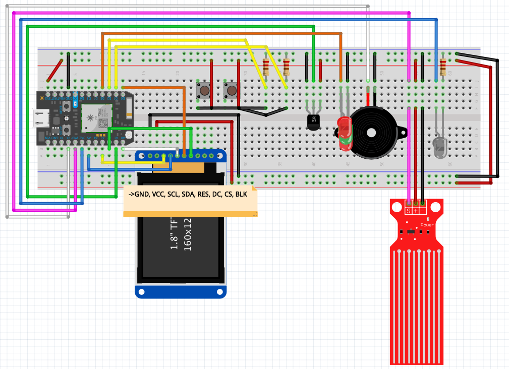

# Dokumentasjon - Eksamen, embedded systems

## Hva jeg har laget
Jeg har valgt oppgave B. Med andre ord har oppgaven vært å lage en IOT-dings som
har en eller annen form for nytte- eller underholdningsverdi. Oppgaven spesifiser
at man skal bruke [Particle Photon](https://docs.particle.io/datasheets/wi-fi/photon-datasheet/). 

### Kjernefunksjonalitet

Helt konkret har jeg laget en nattbordsalarm, med litt ekstra funksjonalitet. 
Hovedideen er at alarmen skal vekke deg på det tidspunktet du må stå opp for 
å rekke å komme deg dit du skal, med kollektivtransport. Den stilles altså ikke 
på tidspunkt for vekking (direkte), men heller på hvor du skal reise fra, 
hvor du skal reise til og ikke minst når du skal ankomme din destinasjon. 

En viktig del av konseptet er at den er oppdatert på sanntidsdata. På den måten
vil alarmen vekke brukeren tidligere/senere dersom det oppstår endringer i
kollektivtransporten i løpet av natten, gjennom en integrasjon med [Entur](entur.no)

Starten på min dag styres i stor grad av hvilken bane jeg må rekke, til dagens
forelesning. Jeg bruker meget kort tid hjemme før jeg drar, og spiser ofte
frokost på veien. Med andre ord står jeg mer eller mindre opp til T-banen. 
Det er mange positive sider for dette for en student som ikke liker morgener, 
men det betyr at jeg er sårbar for forsinkelser og endringer i rutetabeller. 
Det betyr også at vekkealarmene mine knyttes tett opp til rutetider - det er
nyttig for meg å få kombinert rutetider og vekking i samme "dings". At den i 
tillegg kan justere seg etter forsinkelser mer eller mindre i sanntid, er en 
stor bonus. 

Alarmen kan konfigureres gjennom et webgrensesnitt (i [./web](./web)), blant
annet. Webgrensesnittet blir beskrevet nærmere [senere](#webgrensesnitt). 
Man kan også konfigurere alarmen gjennom funksjoner som er tilgjengelige
i Particle sin
app([iOS](https://apps.apple.com/us/app/particle-iot/id991459054) og [Android](https://play.google.com/store/apps/details?id=io.particle.android.app&hl=en_US)). 

### Øvrig funksjonalitet
I tillegg til denne kjernefunksjonaliteten, har jeg laget annen
ekstra-funksjonalitet i tillegg, som jeg skal beskrive i kommende avsnitt. 

* Alarmen har en skjerm som til en hver tid viser et alarmens status til brukeren. 
Brukergrensesnittet består av forskjellige "skjermer" (moduser, vinduer e.l.)
som viser forskjellig informasjon. Man kan bytte mellom disse med å trykke på 
frem- og tilbake-knapper. Når man bytter, spilles det en liten tone for å gi
tilbakemelding til brukeren. 

* Følgende skjermer er tilgjengelig: 
 1. Temperatur
    * Viser temperaturen inne, som leses med en sensor
    * Viser temperaturen i egenkonfigurert by (via. webhook TODO: link til senere omtale
     avwebhooks) 
 2. Alarm 
    * Viser tidspunktet for neste alarm 
 3. Melding
    * Viser en egen hilsen, som brukeren kan legge inn selv (":-)" som default)
 4. Klokke
    * Viser nåværende klokkeslett, dag og måned
   
* Det er mulig å endre bakgrunns- og tekstfarge via "Particle Cloud Functions",
  for eksempel via webgrensesnittet. 

* I et forsøk på å varsle om skader, vil alarmen dessuten sende mail (TODO:
  valgfri epost.) dersom alarmen blir utsatt for flamme eller vann. Dette gjøres 
  med tilkoblet vann- og flammesensor, og integrasjon med
  [Mailgun](https://www.mailgun.com/).
  Det vil være katastrofalt for alarmen dersom den blir utsatt for noen av disse 
  tingene, og derfor gjelder det å si ifra. Det er også ment som en liten
  "homage" til [denne scenen](https://youtu.be/xqQ6Z-HmAqY?t=47). Dersom man plasserer alarmen litt taktisk, 
  kan man jo tenke seg at vannsensoren ville plukke opp potensielle vannskader
  før de ble kritiske for huset.
  Underholdningsverdien rundt det å sende mail ved en slik krise er kanskje vel
  så relevant for oppgaven som noen potensiell "nytteverdi".  
  
* Julemodus - Jeg har lagt inn en sesongaktuell julemoduls, som kan aktiveres
  via via grensesnitt/functions. Alarmen spiller en liten julesang og har fine 
  LED-lys i julefarger. Dette er en ren underholdningsfeature for en juleelsker
  som meg selv, for å gi ekstra god stemning i eksamensperioden! 

### Eksponering av data 
Jeg har hatt en baktanke om at oppgaven fokuserer på IoT.
Det betyr at jeg ikke har hatt et veldig stort fokus på sensorer og oppkoblinger 
med mindre jeg har sett nyttige, morsome eller koselige bruksområder. 

Den dataen som behandles av dingsen, gjøres stort sett tilgjengelig via [Cloud
Functions](https://docs.particle.io/reference/device-os/firmware/photon/#cloud-functions). 
Dette gjør at man ikke er begrenset til det selve mikrokontrolleren kan gjøre
med dataen, men at man kan bygge masse tjenester og integrasjoner i samspill med
det som skjer på Photon-devicen. Webgrensesnittet jeg har laget er et eksempel
på dette. 

Om iot-mulighet for interaksjon med eksterne tjenester, som jeg har brukt 

Dersom man eier de rette nøklene og eier dingsen, gis det tilgang på: TODO:dobbeltsjekk tilgang
* Nåværende tidspunkt for alarm 
* Ekstra tid man trenger til nærmeste stopp 
* Stasjoner for avreise og ankomst 
* Når man ønsker å ankomme innen 
* Informasjon om temperature, som valgt by, og temperaturene som leses 
* Hvorvidt alarmen er aktivert eller ikke 
* Nåværende fargekonfigurasjoner 
* Nåværende egendefinert melding
* E-post som skal få mail ved skadevarsel

Det eksponeres også relevant funksjonalitet for å endre på denne dataen, som gir 
masse muligheter for å bygge videre i fremtiden. Har man flere dingser, kan 
man kombinere flere ting, og få desto flere muligheter. 

Tilkoblingen til nett gjør dessuten at man kan koble andre løsninger på sin
egen. Dette er svært viktig for min løsning, i og med at kjernefunksjonaliteten 
bygger på Entur sitt [API for reiseplanlegging](https://developer.entur.org/pages-journeyplanner-journeyplanner).
Jeg benytter meg også av [Mailgun sitt API]. Disse tjenestene skriver jeg mer om 
under [integrasjoner](#integrasjoner). 

### Webgrensesnitt
For å gjøre løsningen mer tilgjengelig for brukeren, har jeg laget et lite
segrensesnitt som gjørd et enklere å konfigurere alarmen. Her kan man endre
innstillinger, og se status på alarmen. Grensesnittet kjører HTTP-kall mot 
[Particle Device Cloud
API](https://docs.particle.io/reference/device-cloud/api/), og står helt fritt 
fra den fysiske dingsen. Grensesnittet kommuniserser også med [entur sitt
API](https://developer.entur.org/pages-nsr-nsr) for Nasjonalt
Stoppestedsregister, for å gjøre det mer brukervennlig å endre stoppesteder.

#### Oppsett 
* en `.env`-fil i `./web` som inneholder følgende: 
  * `DEVICE_ID=my_device_id` (se på dine "devices" i [Particle IDE](https://build.particle.io/build/new))
  * `ACCESS_TOKEN=my_access_token`(se [her](https://docs.particle.io/reference/device-cloud/api/#generate-an-access-token))
* installer `node` og `yarn`/`npm`
* kjøre `yarn dev`/`npm run dev` i `./web`

## Integrasjoner 
TODO: hvilke integrasjoner jeg har, hvor JSON-filene ligger og hvordan de
funker, overordnet.

Om restriksjoner med gratis-domene i mailgun TODO 
om nøkler TODO
## TODO Argumenter emer for Nytte- og underholdningsverdi

## Tanker om kode
* C++ for første gang her, holder meg nære C 
### Overordnet struktur og stil 
### UI-"rammeverk"
### Reflekter rundt valg av bibliotek 
## Mulige utvidelser
TODO: skriv om mulige utvidelser

## Komponenter fra settet 
* Particle Photon
* Breadboard
* Fargeskjerm
* Flammesensor
* Vannsensor
* LM35 temperatursensor
* Fargeskjerm
* 2x LED rød
* 1x LED grønn
* 3x 220 resistor 
* 2x push-button (6x6mm)
* Koblingskabler 

## Om film
Jeg har lagt ved flere små filmer. 
Jeg har delt opp filmene fordi jeg tror det gjør det lettere å vise dingsen. 
Det er flere funksjoner her, og selv om jeg mener at alle funksjonene har nytte- 
og/eller underholdningsverdi på en alarmklokke, tror allikevel det hadde blitt 
litt rotete å stappe alt sammen inn i samme video. 
* Videoer jeg har lagt ved:
TODO: listen
TODO: skrive om alarmlyd som er vond og tidspunkt som allerede stpr i GUI (feil) 

## Koblingsskjema
Det er noen avvik i koblingsskjemaet: 
* Skjermen er ikke den samme, men en som ligner, med PIN-navn på et notat. 
* Flammesensoren representeres med en grå, infrarød LED

Jeg har lagt ved skjemaet som `.fzz` og `.png`. 

## Kilder 

* JEg har tenkta tdette er iot, og at mye derfor bør skje over nett. 
* C++ for første gang her, holder meg nære C 

- [ ] GUI for alarm sitt tidspunkt 
- [ ] Fikse at alarm faktisk ringer
- [ ] Hente stasjoner i GUI  

# Dokumentasjon 

* skriv om fronted -> setup med .env
* forskjellige maater aa endre tidspunkt paa (iso/individuel)
* Koblet opp mye mot cloud (eksponert vars osv.) for aa kunne utvide mer senere 
* flammemail referanse til IT project  
* legg til screenshot av webhook-config (sladd nøkler)
* Nasjonalt stoppestedsregister (NSR) -> https://stoppested.entur.org/?stopPlaceId=NSR:StopPlace:13825, logg inn med guest/guest
* om nøkler
* om regelmessig oppdatering av alarm

* Oversikt over komponenter 
* Skrive hvilke komponenter 
* Reflekter rundt valg av bibliotek 
* Hvordan oppgaven ble angrepet 
* Beskriv hva du har tenkt med koden (ikke hvordan den fungerer) 
* Sannsynliggjøre at du har forstått oppgaven 
* Sjekk en v første slides fra iot-forelesning

* koplingsskjema - Fritzing 
* bruke LED-driver 
* film av prosjekt 
* Forklaring i dokumentasjon
* __veldig viktig med ekstra features__ 
* ryddig kode 

- God dokumentasjon 
- Unoedvendige ting som er morsomme 
- leking 
- god kode
- ikke hardkod verdier 
- gjør noe ekstra -> lite til for at det er bedre 
- Bygg inn noe analogt 

Krav: 
* Løser oppgaven: C 
* Mer enn nødvendig, ekstra funksjoner: B
* Mange forskjellige, morsomme ting som passer produktet: A  

Et mål å vise det man har lært 

Dokumentasjon: 
Hvis man ikke kan forklare noe, betyr det at man ikke kan det. 
Det er et utgangspunkt at den som leser er en ekstern sensor som kan _litt_ Arduino. Vedkomne skal forstå hvordan ting fungerer. Prinsipper. 
* Forklar spesielle ting man må gjøre 
* Begrunn valg man tar 
* Kode bør i utgangspunktet forklare seg selv 
